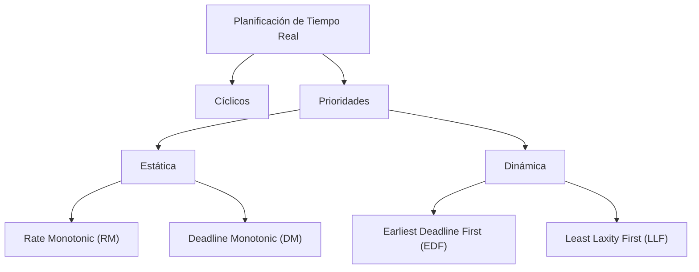

# Explicación general de Planificadores en Tiempo Real

## Clasificación

- **Prioridades:** En tiempo de ejecución se ejecuta la tarea de más prioridad activa. La asignación de prioridades puede ser:

  - **Estática.**

  - **Dinámica.**

### Planificadores con Prioridades Estáticas

Prioridad de cada tarea constante durante toda la vida del sistema que se calcula antes de su ejecución. Se ejecutan por su prioridad. La prioridad de un proceso se deriva de sus requisitos de temporización, no de su importancia para el correcto funcionamiento o para la integridad del sistema.

#### Rate Monotonic (RM)

El esquema **Rate Monotonic** (tasa monotónica) es un método **óptimo** de asignación de prioridades para tareas periódicas cuando los plazos de las tareas son iguales a sus periodos.

- A cada proceso se le asigna **una única prioridad**, basada en su período.
- Cuanto **menor sea el período** de una tarea, **mayor prioridad** tendrá (es decir, más frecuente ⇒ más prioridad).
- Los deadlines coinciden con los periodos:

  $$
  D_i = T_i
  $$

- La ejecución es **apropiativa** (se puede interrumpir a una tarea para ejecutar otra de mayor prioridad).
- Es óptima porque, si un conjunto de procesos puede ser planificado con un esquema de prioridades fijas, entonces ese conjunto también puede ser planificado con RM.

#### Deadline Monotonic (DM)

El algoritmo **Deadline Monotonic (DM)** es una extensión de RM que permite manejar tareas cuyo **plazo de finalización (deadline) puede ser menor que su periodo**.

- Es idéntico a RM, pero se generaliza al caso en que:

$$
D_i \leq T_i
$$

- La asignación de prioridades se hace en **orden inverso a los plazos relativos**:

  - Tareas con plazos de finalización más breves reciben mayor prioridad.

- Es un método **óptimo** dentro de los algoritmos con prioridades estáticas:
  si un conjunto de tareas con deadlines menores a su período es planificable por algún algoritmo estático, entonces DM también podrá planificarlo.

### Planificadores con Prioridades Dinámicas

Las prioridades varían con el tiempo según unas determinadas reglas.

#### Earliest Deadline First (EDF)

El algoritmo **Earliest Deadline First (EDF)** asigna siempre la **máxima prioridad** a la tarea cuyo **plazo de finalización (deadline) esté más próximo**.

- La prioridad de cada tarea se calcula **dinámicamente durante la ejecución**.
- La prioridad puede cambiar a lo largo de la ejecución de una tarea y en diferentes activaciones.
- Es un método **óptimo** bajo las siguientes restricciones:

  - Tareas independientes.
  - Planificación apropiativa.
  - Sistema monoprocesador.

#### Least Laxity First (LLF)

El algoritmo **Least Laxity First (LLF)** asigna prioridades en función de la **holgura** (o laxidad) de las tareas.

- La **laxidad** de una tarea en un instante \$t\$ se define como:

$$
Laxity = Deadline\ Absoluto - Tiempo\ Actual - Tiempo\ de\ Ejecución\ Restante
$$

- La prioridad más alta se asigna a la tarea con **menor holgura**.
- En otras palabras:

  - Una tarea con poco margen de tiempo para terminar (plazo próximo y mucho cómputo pendiente) se vuelve prioritaria.
  - Una tarea con holgura amplia (plazo lejano o poco cómputo pendiente) queda con menor prioridad.

## Test de planificabilidad (factor de utilización)

Para planificadores con prioridades **estáticas** si se cumple la siguiente condición, todos los N procesos cumplirán sus tiempos límite. Un conjunto de \$n\$ tareas será planificable bajo el Rate-Monotonic si se cumple:

$$
  U_{\text{RMS}} = \sum_{i=1}^{n} \frac{C_i}{T_i} \leq n \cdot (2^{1/n}-1)
$$

El test es suficiente pero no necesario. Si un conjunto de procesos pasa el test, entonces cumplirá todos los tiempos límite; si lo falla, puede o no fallar en tiempo de ejecución.

**Nota:** Es lo que usamos para los incisos a) de los ejercicios 1 y 2.

## Ejecutivos Cíclicos

Si todas las tareas son periódicas, se puede confeccionar un plan de ejecución fijo en una tabla.

**Nota:** Es lo que usamos para los incisos b) de los ejercicios 1 y 2.

### Características:

- No se utiliza la concurrencia.
- Se trata de un esquema que se repite cada ciclo principal: \$T_m=\text{mcm}(T_i)\$ siendo \$T_i\$ los tiempos de cada una de las tareas.
- El ciclo principal se divide en ciclos secundarios, con período: \$T_s \mid T_m=k\cdot T_s\$.
- En cada ciclo secundario se ejecutan las actividades correspondientes a determinadas tareas.
- En el planificador solo consulta tabla y el procesador ejecute las tareas siempre en el mismo orden.
- Se coloca “a mano” el orden de ejecución de los trabajos durante un hiperperiodo fuera del tiempo de ejecución.

### Desventajas

- La dificultad para incorporar **procesos esporádicos**.
- La dificultad a la hora de **construir el ejecutivo cíclico**.
- La dificultad **procesos con periodos grandes**; el tiempo del ciclo principal es el máximo periodo acomodable sin planificación secundaria (un procedimiento en el ciclo principal que llame a un proceso secundario cada \$N\$ ciclos secundarios).

Esta última desventaja es la que se evidencia con el ejercicio 2 donde hay una tarea con \$C=7\$

## POSIX 1003.1b

Es un estándar que introduce características de **tiempo real** en sistemas **UNIX**.

- Las tareas pueden ser **periódicas o no**.
- Las tareas se **programan de acuerdo a la prioridad y a la política** de las tareas.
- La **prioridad es estática**.

**Reglas de prioridades:**

- Las tareas **SCHED_RR** y **SCHED_FIFO** deben tener prioridades entre **255 y 1**.
- El nivel de prioridad **0** se reserva para tareas **SCHED_OTHERS**.

**Elección de la tarea:**

- El planificador ejecuta la **tarea lista con mayor prioridad**.
- Si hay varias tareas con el mismo nivel de prioridad, el planificador aplica la política definida (**RR o FIFO**) para decidir cuál ejecutar primero.

## Políticas Implementadas

- **SCHED_FIFO:** Este es el nombre de la política de planificación expulsora con prioridades que usa orden FIFO para determinar el orden en el que se ejecutan las tareas de la misma prioridad.

- **SCHED_RR (Round - Robin (turno rotatorio):** Este es el nombre de la política de planificación expulsora con prioridades que usa un esquema cíclico para planificar tareas de la misma prioridad. Un proceso o hilo se ejecuta hasta que acaba o es bloqueado o hasta que su quantum de tiempo ha expirado; si un proceso/hilo es expropiado por un proceso de mayor prioridad, es colocado a la cabeza de la cola de ejecución para esa prioridad sin embargo, si su quantum expira, será colocado al final.

- **(SCHED_OTHER):** tiene un comportamiento definido por la implementación, que se definió para permitir la compatibilidad con implementaciones preexistentes

#### Ejercicio 3: Uso de POSIX 1003.1b / Highest Priority First en la CPU

En este ejercicio se utilizó la política de **Highest Priority First**, definida dentro del estándar **POSIX 1003.1b**.

##### ¿Qué significa?

- Cada tarea tiene asignada una **prioridad estática**.
- La **CPU ejecuta siempre la tarea lista con mayor prioridad**, interrumpiendo cualquier otra de menor prioridad si es necesario (planificación **preemptiva**).
- En caso de que dos tareas tengan la misma prioridad, se define si el planificador actúa como **FIFO** (se mantiene el orden de llegada) o como **RR** (se alterna entre ellas con un quantum de tiempo).
  **Nota:** Estos planifica (FIFO/RR) es lo que tenemos que cambiar para alcanzar las planificaciones de las dos tareas de los incisos a) y b).

---
